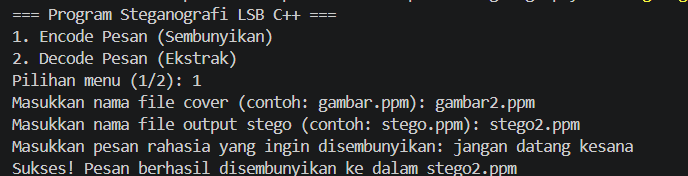
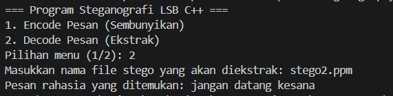

# Steganography LSB

Program ini merupakan implementasi steganografi citra menggunakan metode Least Significant Bit (LSB) dengan bahasa C++. Program memiliki dua fitur utama, yaitu menyembunyikan pesan (encode) dan mengekstrak pesan (decode).

## Alur Program

Saat program dijalankan, pengguna akan memilih menu:

1. Encode Pesan (Sembunyikan)
2. Decode Pesan (Ekstrak)

### 1. Encode Pesan

Pengguna memasukkan nama file citra cover berformat **PPM (P3)**, nama file output, dan pesan rahasia. Setiap bit dari pesan akan disisipkan ke **Least Significant Bit (LSB)** pada komponen pixel citra.

Hasil proses penyisipan disimpan sebagai stego-image dengan format PPM.

### 2. Decode Pesan

Pengguna memasukkan nama file stego-image. Program membaca nilai LSB dari setiap komponen pixel dan menggabungkannya kembali menjadi karakter untuk mendapatkan pesan rahasia.

Proses ekstraksi berhenti ketika program menemukan karakter `NULL (\0)` sebagai penanda akhir pesan.

## Format Citra

Program menggunakan citra dengan format **PPM (P3)** sebagai cover image.

File yang digunakan dalam program:

* `gambar2.jpeg` — gambar asli
* `gambar2.ppm` — gambar cover dalam format PPM
* `stego2.ppm` — hasil steganografi
* `Sahwa_LSB_Steg.cpp` — source code program
* `Image.py` — program pendukung pengolahan citra

## Screenshot Running Program

### Encode

### Decode

