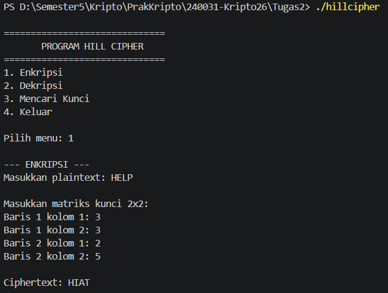
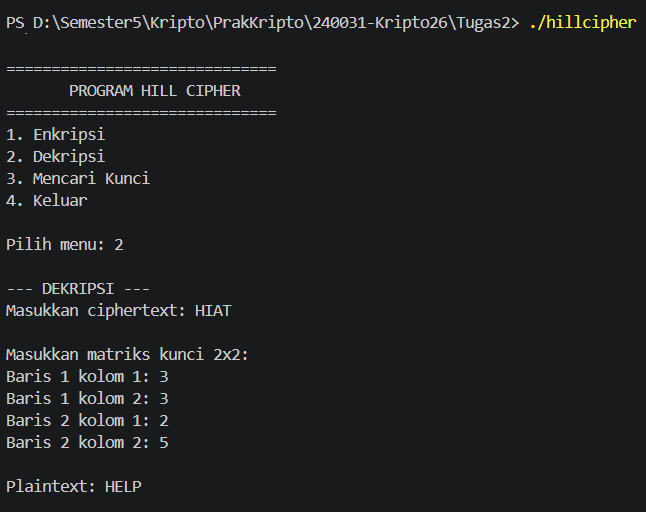
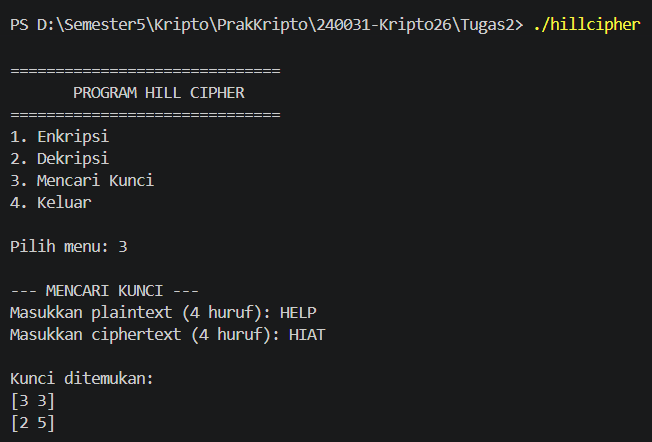

# Hill Cipher
Program ini merupakan implementasi algoritma Hill Cipher 2×2 menggunakan bahasa C++. Program memiliki tiga fitur utama, yaitu enkripsi, dekripsi, dan mencari kunci.

## Alur Program

Saat program dijalankan, pengguna akan memilih menu:
1. Enkripsi
2. Dekripsi
3. Mencari Kunci
4. Keluar

### 1. Enkripsi
Pengguna memasukkan plaintext dan matriks kunci 2×2. Setiap huruf diubah menjadi angka `A=0` sampai `Z=25`, kemudian dihitung menggunakan rumus:

C = K \times P \mod 26

Hasil perhitungan dikembalikan menjadi huruf dan menghasilkan ciphertext.

### 2. Dekripsi
Pengguna memasukkan ciphertext dan matriks kunci. Program mencari invers matriks kunci, kemudian menggunakan rumus:

P = K^{-1} \times C \mod 26

Hasilnya adalah plaintext.

### 3. Mencari Kunci
Pengguna memasukkan plaintext dan ciphertext yang diketahui. Program mencari invers matriks plaintext dan menggunakan rumus:

K = C \times P^{-1} \mod 26

Sehingga matriks kunci dapat ditemukan.

## Screenshot Running Program

### Enkripsi

### Dekripsi

### Mencari Kunci
